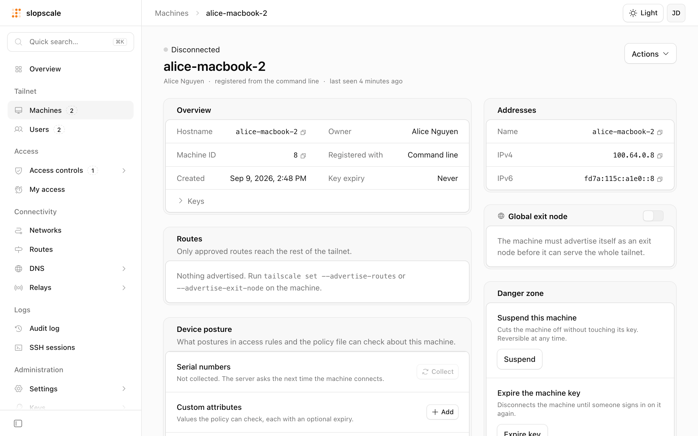

<picture>
  <source media="(prefers-color-scheme: dark)" srcset="docs/assets/readme/console-dark.png">
  
</picture>

# slopscale

An open source, self-hosted implementation of the Tailscale control server.
Point the stock Tailscale clients at slopscale instead of the hosted control
plane: your machines exchange WireGuard keys, get their IP addresses, DNS
and DERP relay from a server you run, under an access policy you write.

slopscale is a fork of [headscale](https://github.com/juanfont/headscale)
with these improvements:

- Faster map responses, lower memory use, a smaller database footprint
- Built-in admin console at `/console/`
- User roles, device and user approval, machine sharing, groups and access
  rules, temporary access, device trust
- OAuth clients with scopes, so the Tailscale Terraform provider and Kubernetes
  operator work unchanged
- DNS, DERP relays, key expiry and certificates configurable at runtime
- Webhooks, log streaming, audit log, SSH session recording
- Bug fixes to the control protocol: exit node suggestions, ephemeral
  registration, DNS records, deleted machines, and more

The [documentation](https://aislopware.github.io/slopscale/) covers setup and
every feature. [CHANGELOG.md](CHANGELOG.md) lists what changed against
headscale, including the rename.

This project is not associated with Tailscale Inc. or the headscale project.
